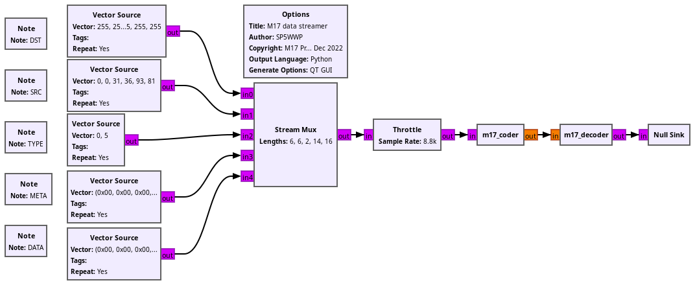

## Compiling:

```
cd build
cmake ../
make -j12
sudo make install
```

will finish with a statement such as
```
-- Set runtime path of "/usr/local/lib/python3.11/dist-packages/gnuradio/m17/m17_python.cpython-311-x86_64-linux-gnu.so" to ""
```
meaning that variables must be set to help GNU Radio Companion find the Python libraries:

```
export LD_LIBRARY_PATH=$LD_LIBRARY_PATH:/usr/local/lib/x86_64-linux-gnu/
export PYTHONPATH=/usr/local/lib/python3.11/dist-packages/

where the ``LD_LIBRARY_PATH`` setting results from
```
find /usr/local/ -name libgnuradio-m17.so.1.0.0 -print
```

When running the flowgraph found in ``examples`` 



the output should be

```
Executing: /usr/bin/python3 -u .../M17_Implementations/SP5WWP/gr-m17/examples/m17_streamer.py

LSF
DST: VRKUF66B. SRC: 1DXUV9ELM TYPE: 6A75 META: 41141276B381C3FC721A0C941B58 LSF_CRC_ERR
LSF
DST: VRKUF66B. SRC: 1DXUV9ELM TYPE: 0000 META: 0000000000000000000000000000 LSF_CRC_OK 
LSF
DST: VRKUF66B. SRC: 1DXUV9ELM TYPE: 0000 META: 0000000000000000000000000000 LSF_CRC_OK 
LSF
DST: VRKUF66B. SRC: 1DXUV9ELM TYPE: 0000 META: 0000000000000000000000000000 LSF_CRC_OK 
LSF
DST: VRKUF66B. SRC: 1DXUV9ELM TYPE: 0000 META: 0000000000000000000000000000 LSF_CRC_OK 
LSF
DST: VRKUF66B. SRC: 1DXUV9ELM TYPE: 0000 META: 0000000000000000000000000000 LSF_CRC_OK 
LSF
DST: VRKUF66B. SRC: 1DXUV9ELM TYPE: 0000 META: 0000000000000000000000000000 LSF_CRC_OK 
FN: E554 PLD: 19257C912E14303A181858DE73A57F62
LSF
DST: TWU.JKNGH SRC: GADDB5D-W TYPE: 8781 META: 719367573AD8DC5D95DE2E4120A6 LSF_CRC_ERR
FN: FB79 PLD: B2A0944FD6169FDA01A4D84B98418146
LSF
DST: T LMVLZ-- SRC: LH4D0 4-N TYPE: CD72 META: E03370AFFC6B1C3458ACC89B7F88 LSF_CRC_ERR
FN: 72ED PLD: FD5466B85FB40451D353D7C5F82E20EF
LSF
DST: DYT2ICEJU SRC: AFNQXED-W TYPE: DAFF META: 171E70AE5C421C5DF62734C88FA5 LSF_CRC_ERR
FN: D908 PLD: 504F3A6F6CF19FC64753CBAF93D2652F
LSF
DST:           SRC: /EIVSH/OB TYPE: F980 META: 00D5EA5CBAD31BB4581BE0170DCD LSF_CRC_ERR
FN: 2CED PLD: 2899A0008A519A0FE7512DAD60FD7F2F
FN: CA54 PLD: 504E20008CE8AE642C9542B74674DC2F
FN: 463E PLD: BFC5AAFFD6A2CE4847DEEDD7FF7DF368
FN: 312D PLD: A55CCC5F02D97778D98FED34BFE61239
FN: 1F6A PLD: 357A4724CFD9C333544AABB5353F6D56
FN: 3A57 PLD: 5C9F3CB1B68E817F01B652621C3B1B30
FN: 92A0 PLD: E3D16AE3718702B46115F7CF5FE67AF6
FN: 1F6A PLD: 357A4724CFD9C333544AABB5353F6D56
FN: 3A57 PLD: 5C9F3CB1B68E817F01B652621C3B1B30
FN: 92A0 PLD: E3D16AE3718702B46115F7CF5FE67AF6
FN: 1F6A PLD: 357A4724CFD9C333544AABB5353F6D56
FN: 3A57 PLD: 5C9F3CB1B68E817F01B652621C3B1B30
FN: 92A0 PLD: E3D16AE3718702B46115F7CF5FE67AF6
FN: 1F6A PLD: 357A4724CFD9C333544AABB5353F6D56
FN: 3A57 PLD: 5C9F3CB1B68E817F01B652621C3B1B30
FN: 92A0 PLD: E3D16AE3718702B46115F7CF5FE67AF6
FN: 1F6A PLD: 357A4724CFD9C333544AABB5353F6D56
FN: 3A57 PLD: 5C9F3CB1B68E817F01B652621C3B1B30
FN: 92A0 PLD: E3D16AE3718702B46115F7CF5FE67AF6
FN: 1F6A PLD: 357A4724CFD9C333544AABB5353F6D56
FN: 3A57 PLD: 5C9F3CB1B68E817F01B652621C3B1B30
FN: 92A0 PLD: E3D16AE3718702B46115F7CF5FE67AF6
FN: 1F6A PLD: 357A4724CFD9C333544AABB5353F6D56
```

Warning: the default gr_modtool is to inform GNU Radio Companion to ``import m17`` rather than
``from gnuradio import m17``. This has to be changed in the YML files.
