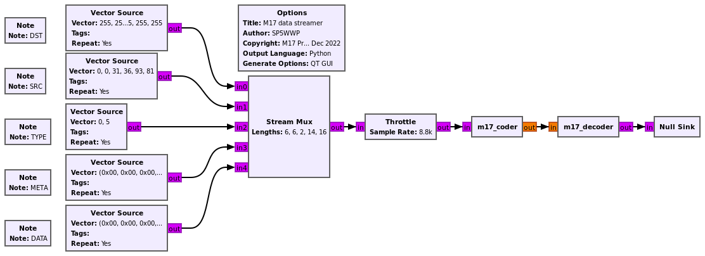

## Compiling:

```
cd build
cmake ../
make -j12
sudo make install
```

will finish with a statement such as
```
-- Set runtime path of "/usr/local/lib/python3/dist-packages/m17/_m17_swig.so" to ""
```
meaning that variables must be set to help GNU Radio Companion find the Python libraries:

```
export LD_LIBRARY_PATH=$LD_LIBRARY_PATH:/usr/local/lib/x86_64-linux-gnu/
export PYTHONPATH=/usr/local/lib/python3/dist-packages/
```

where the ``LD_LIBRARY_PATH`` setting results from

```
find /usr/local/ -name '*m17.so*' -print
```

When running the flowgraph found in ``examples`` 



the output should be

```
```
